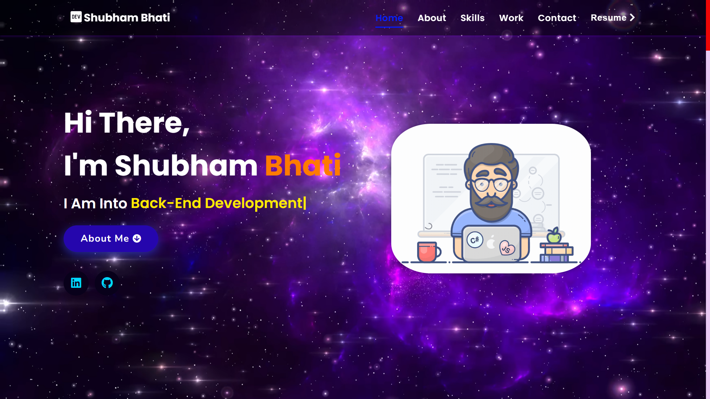
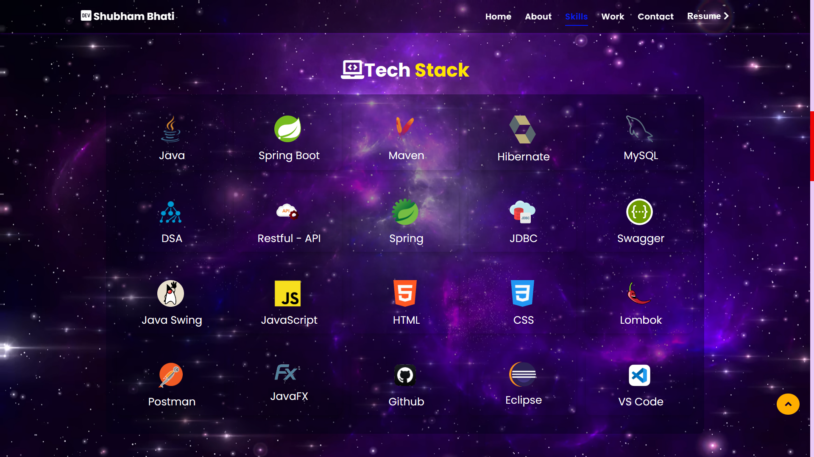

 # Shubham Bhati Portfolio

<a href="https://ShubhamBhati.github.io/" target="_blank">**Visit Now** 🌐🖇️</a>

<!-- # Overview

<h2 align="center">
  
   
</h2>

:star: Star me on GitHub — it helps! -->

### <h1 align="center">Website Preview 💻</h1>
#### Home Section

#### About Section

#### Projects Section

  
  #### Contact Section

#### Skills Section

:star: Star me on GitHub — it helps!

## Features 📋
⚡️ Fully Responsive\
⚡️ Valid HTML5 & CSS3\
⚡️ User can Download Resume\
⚡️ Typing animation using `Typed.js`\
⚡️ Easy to modify\
⚡️ User can connect in different platforms

## Installation & Deployment 📦
- Clone the repository and modify the content of <b>index.html</b> 
- Add or remove images from `assets/img/` directory as per your requirement.
- Update the info of `projects` folder according to your need
- Use [Github Pages](https://create-react-app.dev/docs/deployment/#github-pages) to create your own website.
- To deploy your website, first you need to create github repository with name `<your-github-username>.github.io` and push the generated code to the `master` branch.

## Sections 📚
✔️ About\
✔️ Projects \
✔️ Skills \
✔️ Resume\
✔️ Contact Info

## Tools Used 🛠️
    

 

## Contributing 💡
#### Step 1️⃣    -> Clone this repo to your local machine 🖥️.

#### Step 2️⃣    -> **Build your code** ⚒️

#### Step 3️⃣    -> 🔃 Create a new pull request.

<a href="https://ShubhamBhati.github.io/" target="_blank">**Visit Now** 🚀</a>

<h2>📬 Contact</h2>

If you want to contact me, you can reach me through below handles.

&nbsp;&nbsp;<a href="https://www.linkedin.com/in/shubham-bhati-787319213/"></img></a>

