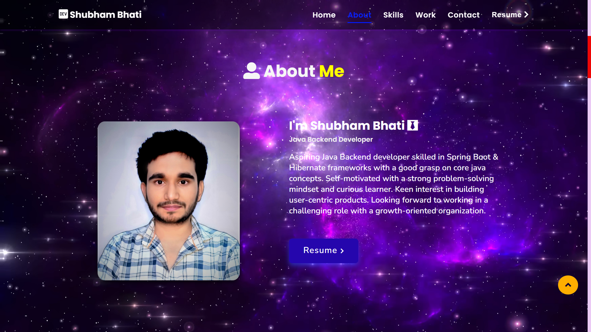
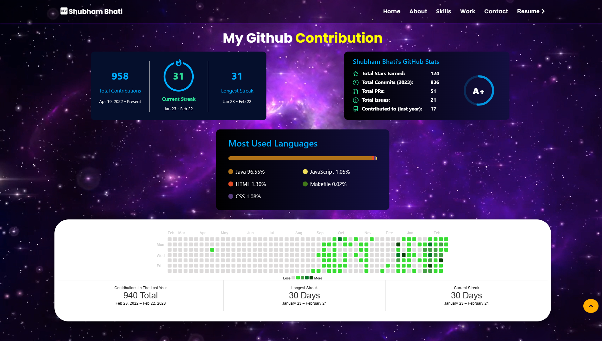
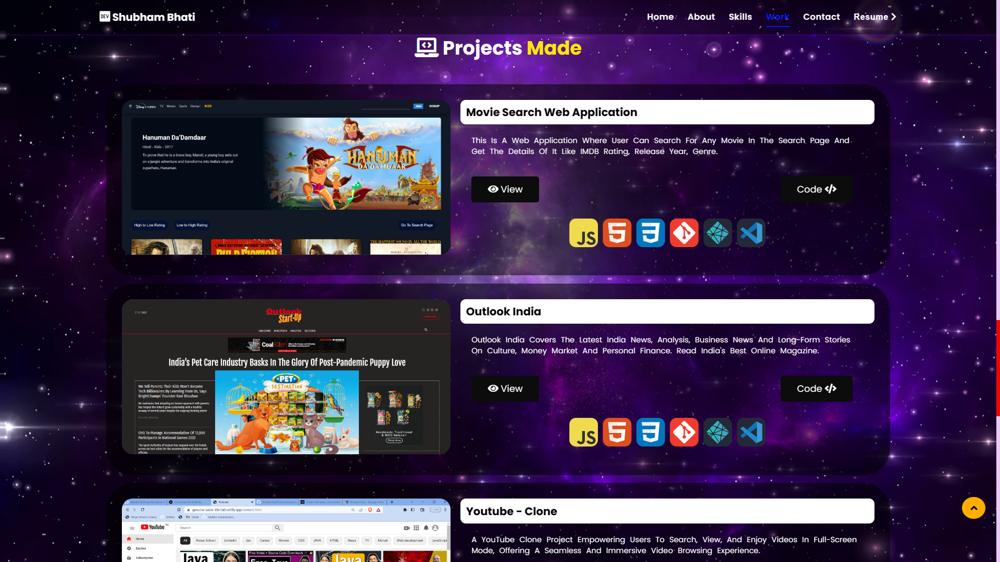
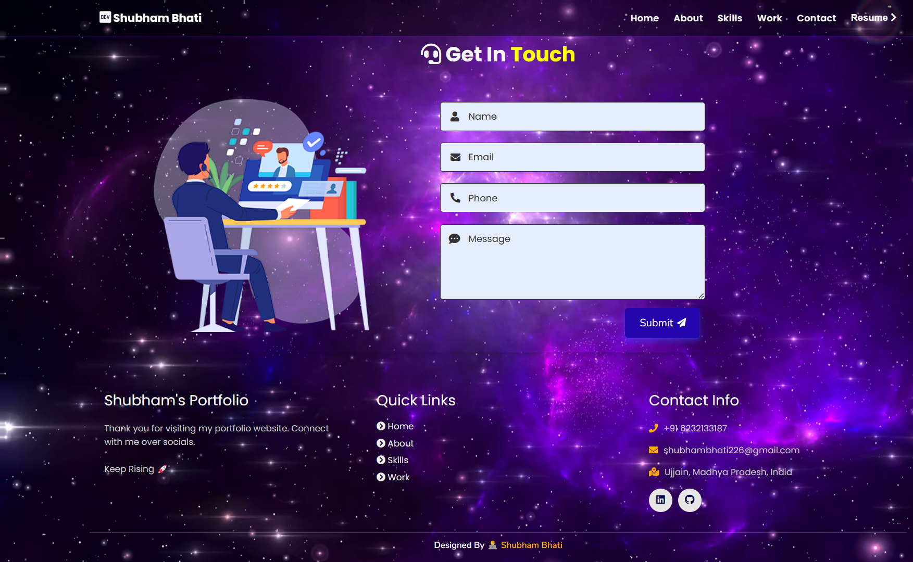

 # Portfolio Website

This personal portfolio website, constructed with HTML, CSS, and JavaScript, serves as a dedicated platform to exhibit the work and projects of a developer. With a visually appealing homepage, visitors are immediately drawn in and introduced to the site's various sections. The projects section takes center stage, showcasing a collection of the developer's impressive work, including video presentations for backend projects. These videos provide an immersive experience, offering insights into the developer's technical skills and project implementation.

Additionally, the website features a contact form, allowing visitors to connect with the creator by submitting their basic details such as name, phone number, email, and a message. This functionality enables seamless communication, fostering engagement and interaction between the creator and potential clients or collaborators.

With its clean and professional design, the portfolio website effectively showcases the developer's talent and potential in the field of web development. The primary objective is to captivate visitors, encouraging them to explore the projects and facilitating connections for inquiries, collaborations, or general messages.

<a href="https://shubh2-0.github.io/" target="_blank">**Visit Now** 🌐🖇️</a>

### <h1 align="center">Website Preview 💻</h1>
#### Home Section

 

#### About Section


#### Skills Section


#### GitHub Section



#### Projects Section



  #### Contact Section



 

:star: Star me on GitHub — it helps!

## Features 📋

- **Fully Responsive:** The portfolio is designed to be responsive, ensuring a seamless experience across different devices and screen sizes.
- **Valid HTML5 & CSS3:** The codebase adheres to the latest HTML5 and CSS3 standards, ensuring clean and efficient code.
- **User can Download Resume:** Visitors have the option to download your resume directly from the portfolio website.
- **Typing Animation using `Typed.js`:** The homepage showcases a typing animation effect created using the `Typed.js` library, adding a dynamic element to the design.
- **Easy to Modify:** The code is well-organized and easy to understand, allowing you to customize and personalize the portfolio to your liking.
- **User can Connect on Different Platforms:** The portfolio provides links to various platforms where visitors can connect with you, such as LinkedIn, GitHub, and more.


## Installation & Deployment 📦
- Clone the repository and modify the content of <b>index.html</b> 
- Add or remove images from `assets/img/` directory as per your requirement.
- Update the info of `projects` folder according to your need
- Use [Github Pages](https://create-react-app.dev/docs/deployment/#github-pages) to create your own website.
- To deploy your website, first you need to create github repository with name `<your-github-username>.github.io` and push the generated code to the `master` branch.

## Sections 📚

The portfolio is divided into the following sections:

👤 **About**
Introduce yourself and share your background, skills, and interests.

🚀 **Projects**
Showcase your projects, providing details and showcasing your work.

🔧 **Skills**
Highlight your technical skills and competencies.

📄 **Resume**
Allow visitors to download your resume in a convenient format.

📞 **Contact Info**
Provide various ways for visitors to get in touch with you, such as social media profiles or email.

Feel free to customize and add more information to each section based on your specific portfolio and preferences. 😄

## Tools Used 🛠️
     


<br>


To contribute to the project, follow these steps:

1. 🍴 Fork the repository on GitHub by visiting the following link: [https://github.com/Shubh2-0/Shubh2-0.github.io.git](https://github.com/Shubh2-0/Shubh2-0.github.io.git).

2. 🔽 Clone the forked repository to your local machine using the following command:
```
git clone https://github.com/Shubh2-0/Shubh2-0.github.io.git
```

3. 🛠️ Make your desired changes and enhancements to the project.

4. ✅ Commit and push your changes to your forked repository.

5. 🔄 Create a new pull request from your forked repository to the main repository.

6. ⏳ Be patient and wait for the maintainers to review and merge your pull request.

Thank you for your valuable contribution! 🙌

<a href="https://shubh2-0.github.io/" target="_blank">**Visit Now** 🚀</a>

## 📬 Contact

If you want to contact me, you can reach me through below handles.

 <p align="left">
  <a href="https://www.linkedin.com/in/shubham-bhati-787319213/" target="_blank"></a>&emsp;
  <a title="shubhambhati226@gmail.com" href="mailto:shubhambhati226@gmail.com" target="_blank"></a>&emsp;
  <a href="https://wa.me/+916232133187" target="blank"></a>&emsp;	
 </p>


